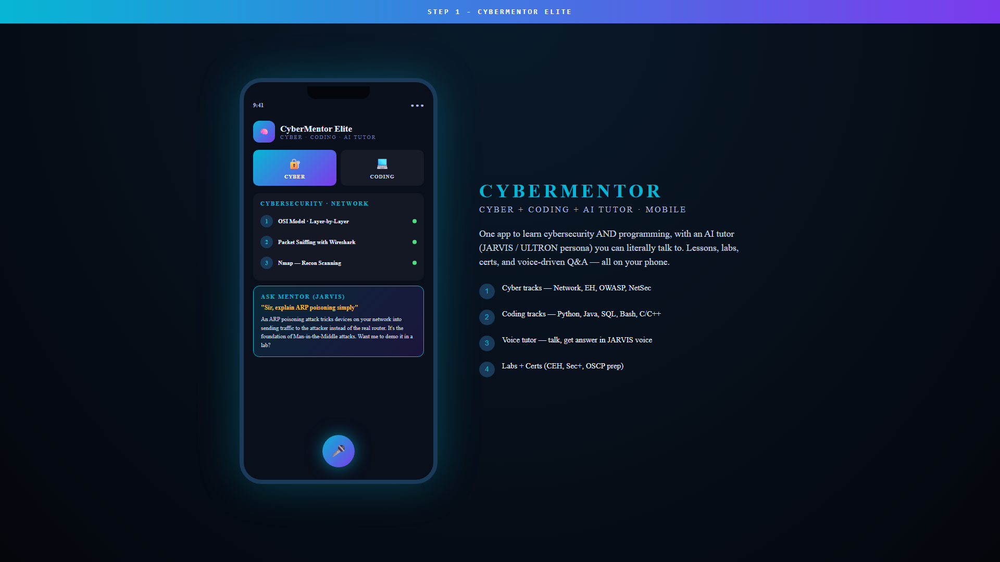

# 🧠 CyberMentor Elite

### All-in-One Mobile Cyber + Coding + Personal AI Tutor

-orange?style=flat-square)

---

> ## 🔒 Source code is private — request access via my GitHub profile.

---

## What is CyberMentor Elite

A Flutter mobile app that teaches **cybersecurity and programming in one place**. PDF lessons, voice-enabled chat with an AI tutor in a JARVIS / ULTRON persona, interactive labs, and certification prep — all on your phone.

Beginners juggle 5 different apps and YouTube channels. CyberMentor Elite is the single mobile hub.

## Demo

(Video URL inserted after drag-drop upload.)

## Two tracks · one app

### Cyber
- **Network** — OSI, TCP/IP, Wireshark, packet sniffing
- **EH** — penetration testing, recon, scanning, exploitation
- **OWASP** — top 10 web vulnerabilities, hands-on
- **NetSec** — firewall, IDS, IPS, segmentation

### Coding
- Python · Java · SQL · Bash · C · C++
- Lesson PDFs + AI Q&A + projects

## Voice tutor — JARVIS persona

The AI tutor is configured with a JARVIS / ULTRON personality. Ask aloud:

> *"Sir, explain ARP poisoning simply"*

…and the mentor answers in plain English with a follow-up suggestion to try a lab.

## Architecture

- Flutter (Android-first, iOS-ready)
- Gemini API for the tutor brain
- Native speech-to-text + text-to-speech for the voice loop
- Firebase Auth + Firestore for sync + progress
- 25-PDF curated curriculum library (separate project)

## Why it matters

Cybersecurity learning is fragmented. CyberMentor compresses it into one app with one voice, one consistent AI brain, and one progress tracker — for the price of zero (free Gemini tier).

## Contact

For source-code access or APK, reach out via my GitHub profile.

## Licence

(c) 2026 Danish · All rights reserved.
